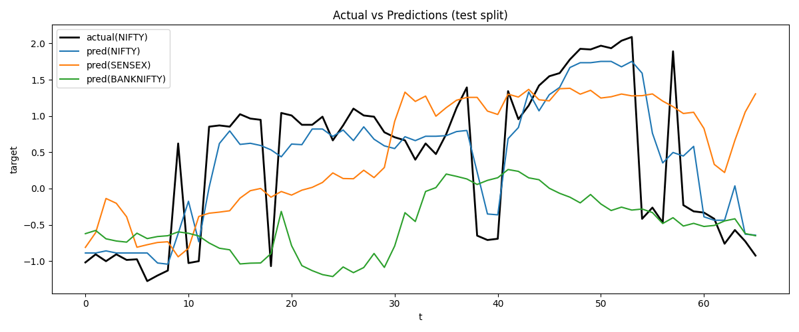
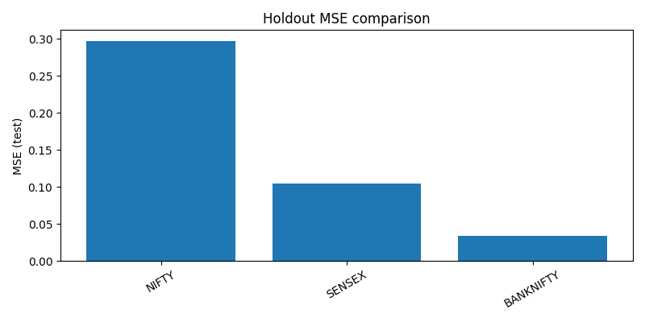

## Running Inference

## Prometheus integration (shared server)

We recommend using a single Prometheus server for both the core project and the ML arm, with separate scrape jobs per service:

- Core orchestrator exposes metrics on 127.0.0.1:9108 (Python prometheus_client)
- ML services should expose metrics on 127.0.0.1:9208 (or another non-conflicting port)

prometheus.yml has two jobs configured:

- g6_core → 127.0.0.1:9108
- g6_ml → 127.0.0.1:9208

Notes:

- For long-running ML services (e.g., FastAPI model server), import `src.metrics.server.setup_metrics_server(port=9208)` at startup and export counters/gauges (e.g., requests, latency, last_prediction).
- For short-lived scripts (one-shot inference), prefer Pushgateway or writing to CSV for Grafana ingestion instead of starting a temporary metrics endpoint.
- Use labels (index, expiry, offset, model_name) to distinguish metrics across indices/models.

Example (Python):

```python
from src.metrics.server import setup_metrics_server
from prometheus_client import Counter, Gauge

metrics, _ = setup_metrics_server(port=9208, host="0.0.0.0")
PRED_REQS = Counter('g6_ml_predictions_total', 'Total prediction requests', ['model', 'index'])
PRED_VALUE = Gauge('g6_ml_prediction_value', 'Last predicted value', ['model', 'index'])

def predict(model, index, x):
  PRED_REQS.labels(model=model, index=index).inc()
  yhat = model.predict(x)[0]
  PRED_VALUE.labels(model=model, index=index).set(float(yhat))
  return yhat
```

This keeps a single Prometheus instance, multiple scrape jobs, and clear separation via labels.

## Live Predictions

Run live inference on the latest CSVs and emit both Prometheus metrics and a CSV that Grafana Infinity can read.

1) One-shot sanity run (prints status JSON and appends one row):

```powershell
C:/Users/Asus/Desktop/g6_reorganized/.venv/Scripts/python.exe scripts/ml/infer_from_latest_csv.py --config configs/ml/nifty_tp_forecast_hgb.json --artifact models/nifty_tp_forecast_hgb
```

2) Continuous mode (keeps metrics fresh on :9208 and appends rows to CSV):

```powershell
C:/Users/Asus/Desktop/g6_reorganized/.venv/Scripts/python.exe scripts/ml/live_predict_exporter.py --config configs/ml/nifty_tp_forecast_hgb.json --artifact models/nifty_tp_forecast_hgb --interval 30 --port 9208
```

The exporter writes to `data/ml/live_predictions/<INDEX>.csv` and exposes metrics like `g6_ml_prediction_value` labeled by model/index/horizon.

### Autostart options

- VS Code task (dev-friendly): Use the task “ML: Start Live Prediction Exporter (continuous)”. It runs in the background with sensible defaults:
  - Config: `configs/ml/nifty_tp_forecast_hgb.json`
  - Artifact: `models/nifty_tp_forecast_hgb`
  - Interval: 30s, Port: 9208

- Auto stack flag (opt-in): Start the exporter automatically when bringing up the local stack:

  ```powershell
  powershell -NoProfile -ExecutionPolicy Bypass -File .\scripts\auto_stack.ps1 -StartPrometheus:$true -StartGrafana:$true -StartWebApi -StartMLExporter -MLConfig 'configs/ml/nifty_tp_forecast_hgb.json' -MLArtifact 'models/nifty_tp_forecast_hgb' -MLInterval 30 -MLPort 9208
  ```

Notes:
- The exporter is opt-in by default to avoid unnecessary CPU/RAM usage, dependency issues (e.g., torch/xgboost), and port collisions in environments that don’t need live predictions.
- Grafana’s Infinity datasource provisioning allows both `http://127.0.0.1:9500` and `http://127.0.0.1:8003`, so the Dashboard API can bind to either without changing dashboards.

# ML Arm: User Guide

This guide explains the machine learning arm in this workspace: what it does, how to run it, how features work (including de-biasing), and how to visualize and compare models.

## Overview

- Goal: Forecast the target `tp` using engineered option/market features with expiry-aware logic.
- Architecture: Plugin-based models + flexible dataset loaders + feature engineering + CLI tools for train/eval/compare.
- Supported indices: NIFTY, SENSEX, BANKNIFTY (configs included).

## Current models and when to use them

- baseline_linear (NumPy least-squares)
  - Strengths: ultra-fast, tiny artifact, interpretable coefficients; good baseline and sanity check.
  - When to use: quick iterations, feature ablations, drift checks; CPU-only environments.
  - Limitations: linear relationships only; underfits non-linearities and interactions unless explicitly engineered.

- sk_hgb_regressor (scikit-learn HistGradientBoosting)
  - Strengths: captures non-linearities and feature interactions; robust to mixed scales; generally best offline accuracy among current plugins.
  - When to use: production-grade tabular regression with moderate compute; default choice for tp forecasting.
  - Limitations: larger artifact than linear, CPU parallelism only; needs careful feature set stability to avoid train/infer mismatch.

- torch_mlp_regressor (PyTorch MLP)
  - Strengths: flexible capacity; can learn complex relationships; GPU-accelerated on compatible setups.
  - When to use: experimentation with deeper capacity or specialized loss functions; when you already have a CUDA stack.
  - Limitations: requires tuning (lr, epochs, hidden_dim); more variance; heavier dependency.

- xgb_regressor (XGBoost)
  - Strengths: state-of-the-art on many tabular problems; fast inference; supports GPU via `tree_method="gpu_hist"`.
  - When to use: production tabular regression with strong non-linearities; when you need more control/performance than sklearn HGB.
  - Limitations: adds dependency; tune key params (n_estimators, learning_rate, max_depth, subsample, colsample_bytree).

- torch_lstm_regressor (PyTorch LSTM)
  - Strengths: end-to-end sequence modeling for longer horizons; can learn temporal dependencies beyond engineered lags/rolling.
  - When to use: requirements specify larger horizons (e.g., 8–32 bars) or you want to reduce manual feature engineering.
  - Limitations: sequence dataset building required (sliding windows); more compute/tuning; care needed to avoid leakage across expiry boundaries.

Practical selection:
- Start with HGB or XGBoost for accuracy on engineered features; keep Linear as a fast health check. Use MLP/LSTM for exploratory sequence capacity.

LSTM note: For pure sequence modeling across long horizons, LSTMs/Transformers can outperform trees if you build sequence windows (e.g., per-expiry sliding tensors) and have sufficient data. Given our engineered lags/rolling already summarize history, boosted trees often match or exceed sequence models with lower ops and simpler deployment. Consider LSTM when you need multi-step dependencies not captured by feature engineering or you want end-to-end sequence learning.

## Sequence mode (LSTM)

To enable sequence modeling, use `sequence_opts` in your config; this builds sliding windows per `groupby_for_sequences` (defaults to `expiry_date`) and trains an LSTM on (N, T, F) tensors.

Example config: `configs/ml/nifty_tp_forecast_lstm.json`

Key fields:
- sequence_opts.seq_len: window length T (e.g., 32)
- sequence_opts.horizon: steps ahead to predict (e.g., 8)
- sequence_opts.groupby_for_sequences: reset windows at these keys (e.g., ["expiry_date"]) to avoid leakage

Train and evaluate:

```powershell
C:/Users/Asus/Desktop/g6_reorganized/.venv/Scripts/python.exe scripts/ml/train_model.py --config configs/ml/nifty_tp_forecast_lstm.json --seed 42
C:/Users/Asus/Desktop/g6_reorganized/.venv/Scripts/python.exe scripts/ml/evaluate.py --config configs/ml/nifty_tp_forecast_lstm.json --split 0.8 --seed 42
```

Notes:
- For long horizons, consider larger `seq_len` and moderate regularization (early stop, smaller hidden_dim).
- Keep bar duration consistent; horizons are in bars. If bar size changes, your effective time horizon changes.
- You can still use engineered features as inputs to the LSTM by listing them in `features` (precomputed in CSVs). Current sequence path does not run FE on-the-fly.

## Feature set overview and rationale

Raw features (from CSVs):
- Market level and contract:
  - index_price, strike, offset (relative bucket), pcr, averages: avg_ce/avg_pe/avg_tp
- Greeks and activity:
  - ce_iv, pe_iv, ce_delta, pe_delta, ce_theta, pe_theta, ce_vega, pe_vega, ce_gamma, pe_gamma, ce_rho, pe_rho
  - ce_oi, pe_oi, ce_vol, pe_vol

Engineered features (expiry-aware):
- Time/expiry context:
  - day_of_week, is_expiry_day, days_to_expiry — encode weekly/expiry effects and time decay pressure
- Moneyness:
  - moneyness = index_price - strike; log_moneyness = log(index_price/strike) — stabilizes across strikes and spot regimes
- Interactions:
  - moneyness_x_dow — simple cross-term for weekday asymmetry across moneyness
- Lags (grouped by expiry_date):
  - for columns ce, pe, tp, pcr with lags L ∈ {1, 5, 10, 20} — short/medium memory of microstructure and flow
- Rolling statistics:
  - mean/std over windows W ∈ {5, 20} for tp, ce, pe, pcr, index_price — trend and volatility context
- Normalization/de-biasing:
  - z-score per keys [day_of_week, expiry_date] with global fallback — removes routine weekday/expiry bias while preserving signal

Why this helps:
- Time and expiry features capture systematic weekly/expiry patterns and day decay.
- Moneyness stabilizes sensitivity across strikes; log form reduces scale issues.
- Lags/rolling encode short-term dynamics and volatility regimes relevant for near-horizon forecasts.
- Per-key normalization removes predictable seasonality so models focus on residual signal.

## Available artifacts and configs (2025-11-03)

Artifacts in `models/`:
- baseline_linear_example.npz
- nifty_index_price_features_linear.npz, nifty_index_price_forecast_linear.npz
- nifty_tp_features_linear.npz, nifty_tp_forecast_linear.npz
- nifty_tp_linear.npz, nifty_tp_linear_index_price.npz, nifty_tp_linear_tp.npz, nifty_tp_linear_tp_net_change.npz
- torch_mlp_example.pt
- sk_hgb_regressor joblib artifacts with FE sidecars:
  - banknifty_tp_forecast_hgb (and banknifty_tp_forecast_hgb.fe.json)
  - nifty_tp_forecast_hgb (and nifty_tp_forecast_hgb.fe.json)
  - nifty_tp_forecast_hgb_noroll (and nifty_tp_forecast_hgb_noroll.fe.json)
  - sensex_tp_forecast_hgb (and sensex_tp_forecast_hgb.fe.json)

Representative configs in `configs/ml/`:
- NIFTY: `nifty_tp_forecast_hgb.json`, `nifty_tp_forecast_hgb_noroll.json`, `nifty_index_price_forecast.json`
- BANKNIFTY: `banknifty_tp_forecast_hgb.json`
- SENSEX: `sensex_tp_forecast_hgb.json`
- Examples: `example_linear.json`, `example_mlp.json`, `example_nifty_dir.json`

## How these models help in practice

- Near-horizon premium forecasting (tp):
  - Estimate next-step tp to assist directional or mean-reversion tactics on CE/PE baskets.
- Strike ranking and selection:
  - Use predictions across offsets (± buckets) to rank attractive strikes under current regime.
- Flow and regime diagnostics:
  - Track residuals (|y_pred − y_true|) over time to detect regime shifts or unstable inputs; surface as an alert.
- Portfolio and risk controls:
  - Calibrate position sizing using predicted variance proxies (rolling std features) and model uncertainty (ensemble spread if using multiple models).
- Dashboarding:
  - Publish predictions to Prometheus/CSV; visualize by index/expiry/offset to guide intraday decisions.

Edge cases to watch:
- First bars after market open may have incomplete Greeks; normalization and NA handling reduce impact but monitor drops.
- On new expiries or rare offsets, lags/rolling may be NA initially; FE drops those rows until windows fill.
- If feature list changes, retrain and keep artifact + FE sidecar in sync to avoid shape mismatches.

## Environment

- Interpreter: Python venv at `.venv/` (already used by the tasks/scripts). Use PowerShell commands shown in this guide.
- Core libs: numpy, pandas, scikit-learn. Torch MLP is optional (best with your Python 3.12 CUDA env).

## Data ingestion

- Directory ingestion with robust CSV parsing and fallback.
- Config controls: `dataset_path`, `dataset_opts` (pattern, recursive, delimiter, na_values, dropna).

## Feature engineering

Engineered features are controlled via `feature_engineering` in the config:

- Time & expiry:
  - `add_time`: adds `day_of_week`, `is_expiry_day`, `days_to_expiry` (from `timestamp` and `expiry_date`).
- Moneyness:
  - `add_moneyness`: adds `moneyness = index_price - strike`, `log_moneyness = log(index_price / strike)`; numeric-safe.
- Lags (expiry-aware):
  - `lag_columns`, `lags`, `groupby_for_lags` (default `expiry_date`); resets sequences at group boundaries.
- Rolling statistics:
  - `roll_columns`, `roll_windows`: rolling mean/std per group if group columns present, else global.
- Simple interactions:
  - `add_interactions`: adds `moneyness_x_dow = moneyness * day_of_week` when available.
- Normalization/de-biasing:
  - `normalize_by`: compute z-score (or center-only) per-key (e.g., `day_of_week`, `expiry_date`), with a global fallback.
  - Training saves a sidecar `*.fe.json` containing statistics used at evaluation time.

## Models (plugins)

- `baseline_linear`: fast NumPy least-squares baseline (`*.npz`).
- `sk_hgb_regressor`: scikit-learn HistGradientBoostingRegressor (`*` saved via joblib).
- `torch_mlp_regressor` (optional): a Torch MLP (`*.pt`).

Registered via `src/ml_arm/registry.py` with a thin `ModelPlugin` interface.

## Core commands

- Train a model from a JSON config:
  - `scripts/ml/train_model.py --config <config.json> --seed 42`
- Holdout evaluation with engineered features and normalization:
  - `scripts/ml/evaluate.py --config <config.json> --split 0.8 --seed 42 [--save-preds path.csv]`
- Walk-forward evaluation:
  - `scripts/ml/evaluate_walkforward.py --config <config.json> --train-groups 4 --test-groups 1 [--save-csv path.csv]`
- Compare multiple configs with plots:
  - `scripts/ml/evaluate_and_plot.py --configs <c1> <c2> ... --labels <l1> <l2> ... --split 0.8 --outdir reports/plots`
- Compare all indices (one-click pack):
  - `scripts/ml/compare_all_indices.py --walkforward --train-groups 4 --test-groups 1 --outdir reports/compare_all`
- Horizon sweeper (exponential horizons):
  - `scripts/ml/evaluate_horizons.py --config <config.json> --max-h 8 --base 2 --split 0.8 --outdir reports/horizons`

See Cheatsheet for more one-liners.

## Configs included

- Rolling HGB (default) for NIFTY/SENSEX/BANKNIFTY:
  - `configs/ml/nifty_tp_forecast_hgb.json`
  - `configs/ml/sensex_tp_forecast_hgb.json`
  - `configs/ml/banknifty_tp_forecast_hgb.json`
- NIFTY no-rolling variant:
  - `configs/ml/nifty_tp_forecast_hgb_noroll.json`

## Visualizations

- Compare all indices (holdout):
  - `reports/compare_all/overlay_predictions.png`: Overlay of actual vs predicted across indices.
  - `reports/compare_all/scatter_predictions.png`: y_true vs y_pred per index.
  - `reports/compare_all/mse_comparison.png`: Bar of holdout MSE per index.
- Walk-forward comparisons:
  - `reports/compare_all/walkforward_plots/wf_mse_line.png`
  - `reports/compare_all/walkforward_plots/wf_mse_box.png`
  - `reports/compare_all/walkforward_plots/wf_mse_bar.png`
- Horizon sweeper (per config):
  - `reports/horizons/<config-stem>/overlay_by_horizon.png`
  - `reports/horizons/<config-stem>/mse_by_horizon.png`

### Example images





*(Generate horizon plots with the sweeper; paths under `reports/horizons/`)*

## How far ahead can we predict?

- Configurable via `feature_engineering.forecast_horizon`.
- Default: `1` (one-step-ahead). You can set `2, 4, 8, ...` (exponential) to test longer horizons.
- Expect accuracy to degrade with larger horizons due to compounding uncertainty.
- We recommend the sweeper to benchmark horizons: `1, 2, 4, 8`.

Advanced:
- Direct multi-step: train a separate model for each horizon `h` (supported now).
- Recursive: re-use the `h=1` model iteratively; needs an inference loop to update lags/rolling with predicted values (can be added if needed).

## Tips & gotchas

- After changing engineered features in configs, retrain to regenerate the artifact (joblib/npz/pt) before evaluating.
- Walk-forward grouping: falls back to sequential chunks if weekday coverage is insufficient in the engineered set.
- Normalization: we fit per-train split stats and apply to test for fair eval (sidecar used when evaluating saved artifacts).

## Troubleshooting

- sklearn import errors: ensure scikit-learn installed in the active venv.
- Feature shape mismatch: retrain the model after changing feature set.
- Too few samples for windows: reduce train/test groups or expand dataset.

## File map

- Featurizer: `src/ml_arm/featurizer.py`
- Models: `src/ml_arm/plugins/`
- Scripts: `scripts/ml/*.py`
- Configs: `configs/ml/*.json`

